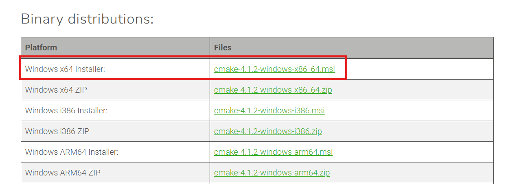
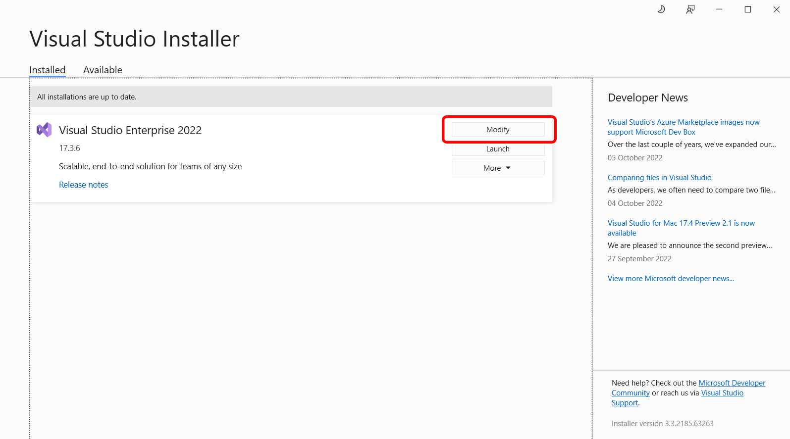
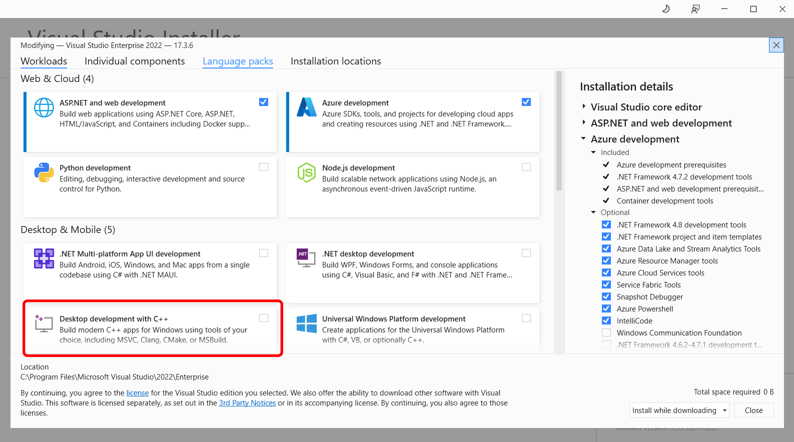
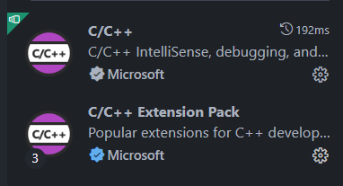
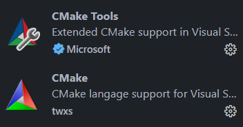

# INTERNSHIP VI-ROSE
## MODUL CMAKE


\
\
\
Pada modul kali ini akan dibahas mengenai penggunaan tools CMake yang akan membantu kita dalam membuat sebuah project C++. Secara Simplenya, CMake adalah sebuah tools yang membantu mempersiapkan kode program kamu untuk bisa di-*build* (diubah menjadi aplikasi yang berekstensi .exe) / Meta-Build System dan akan mempercepat proses kita dalam process mem-*build* kode c++ kita.

### Instalasi CMake & Visual Studio

1. Pertama, kalian perlu untuk mendownload `CMake` dari official websitenya. di link berikut ini,

    `https://cmake.org/download/`\
\
Pada website CMake pilih pada bagian yang diberi tanda merah jika kamu menggunakan windows.\
\
Setelah selesai mendownload filenya, kamu bisa jalankan hasil CMake installernya dan ikuti pentunjuk installernya.

2. Setelah itu kita bisa lanjut dengan mendownload `Visual Studio` sebagai penyedia toolchain/kit (compiler dan alat build).\
\
Untuk mendownload `Visual Studio` kamu bisa mengunjungi link dibawah ini.\
\
`https://visualstudio.microsoft.com/downloads/`\
\
Pilih yang versi **Community**. Dan setelah itu jalankan installernya dan ikuti langkah-langkahnya.\
\
Untuk bagian ini kalian bisa pilih opsi modify.

\
\
Untuk Bagian yang ini, kalian pilih `Desktop Development with C++`\

\
\
Setelah itu kalian bisa klik tombol `modify`.\
\
**(Visual Studio yang ingin didownload di atas berbeda dengan Visual Studio Code).**


### Setup CMake di Visual Studio Code

Sebelum kita bisa menggunakan CMake di VSCode tercinta kita, kita perlu untuk menginstall beberapa extension di VSCode kita. Berikut adalah extension yang perlu untuk didownload,




Keempat extension itu perlu kalian install di VSCode.

### Penggunaan CMake

Ketika kalian ingin menggunakan CMake sebagai Meta-Build System kamu memerlukan 1 sebuah text file yang disebut `CMakeLists.txt` yang akan digunakan sebagai konfigurasi build. Di bawah adalah contoh dari CMakeLists.txt sederhana.

```cmake
cmake_minimum_required(VERSION 3.15)

# Project Name
project("RobotConfig")

# C++ Standard
set(CMAKE_CXX_STANDARD 17)
set(CMAKE_CXX_STANDARD_REQUIRED ON)

# include_directories()

add_executable(test Test.cpp)

# target_link_libraries()
```

#### Struktur Dasar

Setiap file `CMakeLists` **wajib** memiliki dua perintah ini dibagian paling atas.

- `cmake_minimum_required(VERSION XX)`\
  Dengan XX sebagai versi minimum dari CMake yang akan digunakan. Jika versi CMake yang ada lebih rendah dari versi minimum, maka proses konfigurasi akan gagal.

- `project(NamaProject)`\
  Perintah ini digunakan untuk mendefinisikan nama project.

#### Membuat Target

Untuk target yang dimaksud adalah hasil akhir yang ingin di-*build*.

- `add_executable(NamaTarget file1.cpp file2.cpp ...)`
  fungsi di atas adalah untu membuat sebuah program yang bisa dieksekusi (executable) dari satu atau lebih file sumber.

Untuk Project-project yang lebih besar dan menggunakan banyak dependensi eksternal, lebih baik menggunakan fungsi `set()` untuk membuat variable dari direktori yang akan digunakan.

sebagai contoh,

```cmake
set(SOURCES
    main.cpp
    set_config.cpp
    master.cpp
)

set(HEADER
    main.h
    set_config.h
    master.h
)

include_directories(${HEADER})
add_executable(Test ${SOURCES})
```

#### Menghubungkan Target dengan Library

- `include_directories()`\
  perintah yang menambahkan satu atau lebih direktori ke compiler's include path.

- `target_link_libraries(NamaTarget KEYWORD NamaLibrary )`\
    Untuk NamaTarget disama kan dengan nama di `add_executable()`\
  \
  Ada beberapa KEYWORD yang bisa dipakai,
  - PRIVATE: NamaTarget butuh NamaLibrary, tapi target lain yang menggunakan NamaTarget tidak perlu tahu tentang NamaLibrary. Ini kasus paling umum.
  - PUBLIC: NamaTarget butuh NamaLibrary, dan target lain yang menggunakan NamaTarget juga harus di-link dengan NamaLibrary.
  - INTERFACE: NamaTarget sendiri tidak butuh NamaLibrary, tapi target lain yang menggunakannya wajib di-link dengan NamaLibrary.

sebagai contoh, 
```cmake
target_link_libraries(Test PRIVATE $LIBRARY_DIR)
```
\
\
Beberapa referensi untuk syntax CMake dapat lihat di website resminya yaitu,

`https://cmake.org/cmake/help/latest/`

