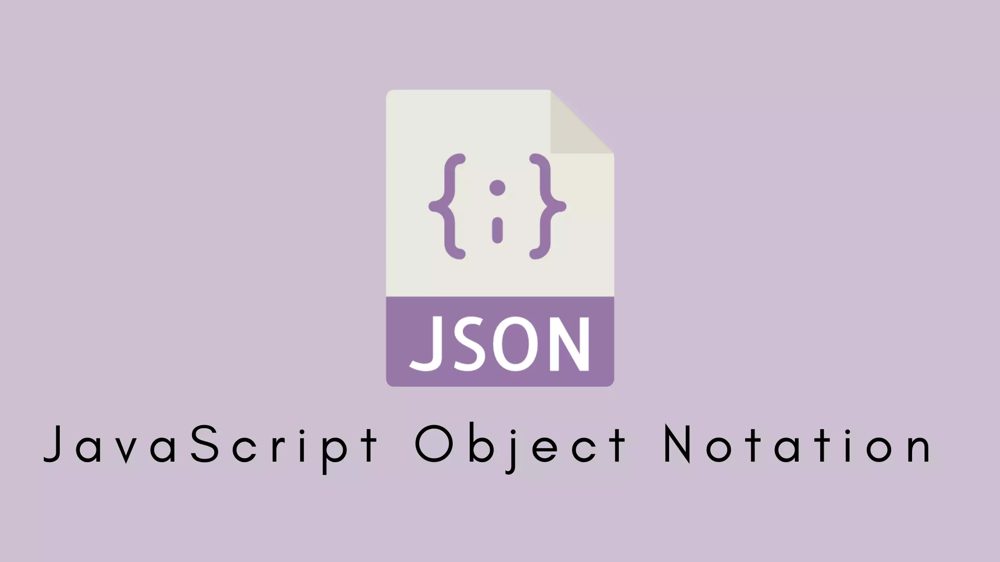

# INTERNSHIP VI-ROSE
## MODUL JSON



JSON (JavaScript Object Notation) adalah format teks ringan untuk menyimpan dan menukar data. Meskipun namanya berasal dari JavaScript, JSON sepenuhnya independen dari bahasa pemrograman apa pun dan didukung oleh hampir semua bahasa modern, termasuk C++. 

JSON ditulis dengan format label dan nilainya.
```json
"firstName":"John"
```
Nama-nama di JSON perlu tanda petik dua bukan 1.


### Aturan dan Sintaks Dasar
JSON hanya memiliki dua "bangunan" utama: Objek dan Array. Segala sesuatu yang lain ada di dalam keduanya.

1. Key-Value Pair (Pasangan Kunci-Nilai)
Ini adalah unit data paling dasar dalam JSON.\
\
Key: Selalu berupa string dalam tanda kutip ("). Berfungsi sebagai label atau nama data.
Value: Bisa berupa salah satu dari tipe data yang didukung.Keduanya dipisahkan oleh titik dua (:).\
\
Contoh: 
```cmake
"nama": "Robot-01"
```

### Tipe Data

JSON mendukung 6 tipe data dasar untuk bagian value:

1. String: Teks biasa, selalu diapit tanda kutip ganda.

```json
"robotName": "Nafa"
```

2. Number: Angka, bisa berupa bilangan bulat atau desimal. Tidak perlu tanda kutip.

```json
"jumlahRoda": 4

"teganganBaterai": 24.5
```

3. Boolean: Nilai true atau false untuk menyatakan kondisi. Tidak perlu tanda kutip.

```json
"aktif": true
```

4. Array: Kumpulan atau daftar nilai yang berurutan, diapit oleh kurung siku []. Setiap elemen dipisahkan oleh koma.

```json
"kecepatan": [ 0.2, 0.5, 0.1 ]
```

5. Null: Mewakili nilai kosong atau tidak ada.

```json
"errorLog": null
```
6. Object: Kumpulan key-value pair, diapit oleh kurung kurawal {}. Digunakan untuk merepresentasikan data yang lebih kompleks.


Berikut adalah contoh untuk sebuah object json.

```json
{
  "robotName": "Nina",
  "ID": 2,
  "ESP-NOW": false,
  "maxSpeed": 1.5,
  "components": [
    "Lengan Kiri",
    "Lengan Kanan",
    "Kaki Kiri",
    "Kaki Kanan"
  ],
  "powerSystem": {
    "batteryType": "Li-Po",
    "voltage": 12.5,
    "cellCount": 1
  },
  "lastCalibration": null
}
```

## Kegunaan Utama

1. File Konfigurasi: Seperti pada contoh di atas, digunakan untuk menyimpan konfigurasi agar mudah diubah tanpa perlu mengompilasi ulang kode.

2. File Motion: Menyimpan file motion untuk diflash ke filesystem ESP32.


## Library/Header
Untuk bisa membaca file .json kita bisa menggunakan library-library yang tersedia di Internet seperti contoh yang akan kita gunakan adalah `rapidJSON`.

`https://rapidjson.org/`\
`https://rapidjson.org/md_doc_tutorial.html`