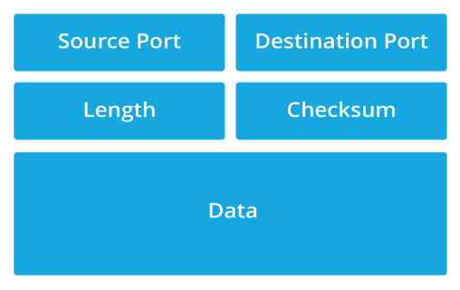

<h1 align="center"> Framework Arduino dan ESP </h1>

## Materi Pembelajaran

- PlatformIO
- Dasar Framework Arduino
- ESP-NOW
- EEPROM Flash
- Simulasi Wokwi

## PlatformIO

1. Install Extension PlatformIO IDE
   

2. Buat Project Arduino

   

   - Pilih "Create New Project".
   - Pilih "New Project"
   - Pada tab Board, pilih "DOIT ESP32 DEVKIT V1" karena kita menggunakan ESP32
   - Pada tab framework, pilih "Arduino"
   - Uncheck "Use default location" jika kalian ingin menyimpannya dalam folder kalian sendiri

   ```
   Note : Kalian akan menunggu selama beberapa menit pada saat pertama kali menggunakan PlatformIO
   ```

3. Penjelasan File & Folder Bawaan

- Folder "src" adalah tempat kerja kalian
- Folder "lib" adalah tempat dari library yang di-include
- "platformio.ini" adalah sebagai tempat konfigurasi utama projek platformIO, digunakan untuk :

  - Konfigurasi Environment

    - Menentukan board yang digunakan, Framework yang dipakai

  - Build Settings

    - Mengatur flag saat compiling
    - Library dependencies (library yang digunakan)
    - Upload Setting(port, speed, method)

  ```ini
  [env:esp32doit-devkit-v1]
  platform = espressif32
  board = esp32doit-devkit-v1
  framework = arduino

  ; Upload settings
  upload_speed = 921600
  monitor_speed = 115200

  ; Library dependencies
  lib_deps =
      adafruit/Adafruit GFX Library @ ^1.11.11
    adafruit/Adafruit SSD1306@^2.5.9

  ; Build flags
  build_flags =
      -D FLAGS
      -D USE_WIFI
  ```

## Dasar Framework Arduino

Framework Arduino adalah framework pemrograman hardware open-source.
Framework Arduino menggunakan bahasa C++

Struktur Program

```cpp
void setup() {
    // Kode inisialisasi - hanya dijalankan sekali
    // Konfigurasi pin, serial, sensor, dll.
}

void loop() {
    // Kode utama - dijalankan berulang-ulang tanpa batas
    // Logic aplikasi utama
}
```

Dokumentasi API Arduino dapat dilihat pada link berikut:
[Arduino Programming Reference](https://docs.arduino.cc/learn/programming/reference/ "A reference to the Arduino Programming Language")

Pelajari untuk memahami beberapa fungsi-fungsi yang ada pada framework Arduino.

Contoh program untuk menyalakan LED ketika BOOT ditekan

```cpp
#include <Arduino.h>

#define BOOT_BUTTON 0        // GPIO 0 is the BOOT button

void setup() {
  Serial.begin(115200);

  pinMode(LED_BUILTIN, OUTPUT);

  pinMode(BOOT_BUTTON, INPUT_PULLUP);

  digitalWrite(LED_BUILTIN, LOW);

  Serial.println("ESP32 BOOT Button LED Control");
  Serial.println("Press BOOT button to toggle LED");
}

void loop() {
  int buttonState = digitalRead(BOOT_BUTTON);

  if (buttonState == LOW) {
    // Button is pressed - turn on LED
    digitalWrite(LED_BUILTIN, HIGH);
    Serial.println("BOOT button pressed - LED ON");
  } else {
    // Button is not pressed - turn off LED
    digitalWrite(LED_BUILTIN, LOW);
  }

  delay(50);
}
```

## ESP-NOW

ESP-NOW merupakan sebuah protokol komunikasi khusus ESP yang simpel, tidak memerlukan handshake atau koneksi formal.

Contoh program sederhana ESP-NOW :

```cpp
#include <Arduino.h>
#include <esp_now.h>
#include <esp_wifi.h>
#include <WiFi.h>

#define MAC_LENGTH 6
#define MAC_ADDRESS_TOTAL 12


uint8_t mac_addresses[MAC_ADDRESS_TOTAL][MAC_LENGTH] = {
    {0x24, 0x0A, 0xC5, 0x0A, 0x1A, 0x11},
    {0x24, 0x0A, 0xC5, 0x0A, 0x1B, 0x11},
    {0x24, 0x0A, 0xC5, 0x0A, 0x2A, 0x11},
    {0x24, 0x0A, 0xC5, 0x0A, 0x2B, 0x11},
    {0x24, 0x0A, 0xC5, 0x0A, 0x3A, 0x11},
    {0x24, 0x0A, 0xC5, 0x0A, 0x3A, 0x22},
    {0x24, 0x0A, 0xC5, 0x0A, 0x3B, 0x11},
    {0x24, 0x0A, 0xC5, 0x0A, 0x3B, 0x22},
    {0x24, 0x0A, 0xC5, 0x0A, 0xFF, 0xF1},
    {0x24, 0x0A, 0xC5, 0x0A, 0xFF, 0xF2},
    {0x24, 0x0A, 0xC5, 0x0A, 0xFF, 0xF3},
    {0x24, 0x0A, 0xC5, 0x0A, 0xFF, 0xF4},
};

void on_data_sent_cb(const uint8_t *mac, esp_now_send_status_t status) {
    if (status == ESP_NOW_SEND_SUCCESS) {
        Serial.println("Data sent successfully");
    } else {
        Serial.println("Data sent failed");
    }
}

void on_data_recv_cb(const uint8_t *mac, const uint8_t *data, int len) {
    for(int i = 0; i < len; i++) {
        Serial.printf("% ", data[i]);
    }
}

esp_now_peer_info_t peer_info;

esp_err_t setup_esp_now(uint8_t mac_index) {
    esp_err_t result;

    /* Init WiFi to Station Mode and disconnect from any AP */
    WiFi.mode(WIFI_STA);
    WiFi.disconnect();

    /* Init ESP-NOW */
    result = esp_now_init();
    if (result != ESP_OK)
        return result;

    /* Set callback function to handle received data */
    result = esp_now_register_recv_cb(on_data_recv_cb);
    if (result != ESP_OK)
        return result;

    /* Set callback function to handle send data */
    result = esp_now_register_send_cb(on_data_sent_cb);
    if (result != ESP_OK)
        return result;

    /* Set MAC Address */
    uint8_t mac[MAC_LENGTH];
    memcpy(mac, mac_addresses[mac_index], MAC_LENGTH);
    result = esp_wifi_set_mac(WIFI_IF_STA, mac);
    if (result != ESP_OK)
        return result;

    /* Initialize peer_info and set fields*/
    memset(&peer_info, 0, sizeof(esp_now_peer_info_t));
    peer_info.channel = 0;
    peer_info.encrypt = false;

    /* Add All MAC to peer list  */
    for (int i = 0; i < MAC_ADDRESS_TOTAL; i++) {
        memcpy(peer_info.peer_addr, mac_addresses[i], MAC_LENGTH);
        result = esp_now_add_peer(&peer_info);
        if (result != ESP_OK)
            return result;
    }

    return ESP_OK;
}

void setup() {
    Serial.begin(115200);
    pinMode(LED_BUILTIN, OUTPUT);
    digitalWrite(LED_BUILTIN, LOW);
    setup_esp_now(6);

    char data[]= "Hallo";
    esp_now_send(mac_addresses[0], (uint8_t*)data, sizeof(data));
}
void loop() {
}
```

Penjelasan :

- `esp_now_register_recv_cb()` merupakan fungsi yang me-register fungsi callback (fungsi yang akan dipanggil dalam keadaan tertentu) ketika ESP menerima data melalui ESP-NOW.
- `esp_now_register_recv_cb()` merupakan fungsi yang me-register fungsi callback (fungsi yang akan dipanggil dalam keadaan tertentu) ketika ESP mengirim data melalui ESP-NOW.
- `esp_now_send(const uint8_t *peer_addr, const uint8_t *data, size_t len)` merupakan fungsi untuk mengirim `data` dengan jumlah data sepanjang `len` kepada perangkat lain yang memiliki identitas MAC address `*peer_addr`.

## EEPROM Flash

EEPROM merupakan suatu sistem memori pada ESP dimana memori tidak akan terhapus ketika ESP dimatikan. Biasa digunakan untuk konfigurasi dan data penting. EEPROM memiliki default size 512 bytes yang dapat di konfigurasi.

Contoh program yang menggunakan EEPROM :

```cpp
#include <Arduino.h>
#include <EEPROM.h>

#define EEPROM_SIZE 128

void setup() {
    Serial.begin(115200);
    EEPROM.begin(EEPROM_SIZE);
}

void loop() {
    String message = "EEPROM TEST";
    //============= Coba Comment Dari Sini pada upload kedua ===============
    // Write single byte "42" to address 0
    EEPROM.write(0, 42);

    // Write string to EEPROM starting at address 10
    for (int i = 0; i < message.length(); i++) {
        EEPROM.write(10 + i, message[i]);
    }

    // Commit changes to flash (penting!)
    EEPROM.commit();
    //================== Hingga Sini ===================

    // Read single byte from address 0
    int value = EEPROM.read(0);
    Serial.printf("Value at address 0: %d\n", value);

    // Read string from EEPROM
    String readMessage = "";
    for (int i = 0; i < message.length(); i++) {
        char c = EEPROM.read(10 + i);
        readMessage += c;
    }
    Serial.printf("Message from EEPROM: %s\n", readMessage.c_str());

    delay(5000);
}
```

EEPROM dapat sangat berguna ketika ingin program memiliki perilaku berbeda tanpa perlu untuk mengubah ataupun meng-upload ulang kode.

Contoh Implementasi EEPROM :

```cpp
#include <Arduino.h>
#include <EEPROM.h>

#define EEPROM_SIZE 128
#define ADDR_TEST 10

unsigned long previousMillis = 0;
bool ledState = false;

void setup() {
    Serial.begin(115200);
    EEPROM.begin(EEPROM_SIZE);

    // Initialize LED pin
    pinMode(LED_BUILTIN, OUTPUT);

    // Uncomment salah satu baris di bawah untuk mengatur nilai EEPROM
    // EEPROM.write(ADDR_TEST, 0);  // LED mati
    // EEPROM.write(ADDR_TEST, 1);  // Berkedip 300ms
    // EEPROM.write(ADDR_TEST, 2);  // Berkedip 1000ms
    // EEPROM.write(ADDR_TEST, 3);  // Menyala terus
    // EEPROM.commit();  // Jangan lupa commit setelah write

    // Read current value from EEPROM
    int mode = EEPROM.read(ADDR_TEST);
    Serial.printf("LED Mode from EEPROM: %d\n", mode);

    switch(mode) {
        case 0:
            Serial.println("Mode 0: LED OFF");
            break;
        case 1:
            Serial.println("Mode 1: LED Blink 300ms");
            break;
        case 2:
            Serial.println("Mode 2: LED Blink 1000ms");
            break;
        case 3:
            Serial.println("Mode 3: LED Always ON");
            break;
        default:
            Serial.println("Unknown mode, LED OFF");
            break;
    }
}

void loop() {
    // Read LED mode from EEPROM
    int ledMode = EEPROM.read(ADDR_TEST);
    unsigned long currentMillis = millis();

    switch(ledMode) {
        case 0:
            // LED mati
            digitalWrite(LED_BUILTIN, LOW);
            break;

        case 1:
            // Berkedip setiap 300ms
            if (currentMillis - previousMillis >= 300) {
                previousMillis = currentMillis;
                ledState = !ledState;
                digitalWrite(LED_BUILTIN, ledState);
            }
            break;

        case 2:
            // Berkedip setiap 1000ms
            if (currentMillis - previousMillis >= 1000) {
                previousMillis = currentMillis;
                ledState = !ledState;
                digitalWrite(LED_BUILTIN, ledState);
            }
            break;

        case 3:
            // Menyala terus
            digitalWrite(LED_BUILTIN, HIGH);
            break;

        default:
            // Default: LED mati jika nilai tidak dikenali
            digitalWrite(LED_BUILTIN, LOW);
            break;
    }

    // Optional: Check for serial input to change mode
     if (Serial.available()) {
        int newMode = Serial.read();
        if (newMode >= 0 && newMode <= 3) {
            EEPROM.write(ADDR_TEST, newMode);
            EEPROM.commit();
            Serial.printf("LED mode changed to: %d\n", newMode);
        }
    }
}
```

## Simulasi Wokwi
