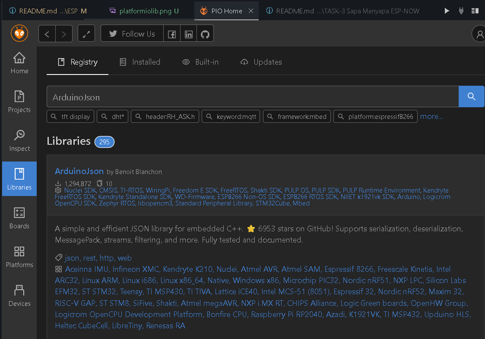

<h1 align="center"> Framework Arduino dan ESP </h1>

## Materi Pembelajaran

- [PlatformIO](#platformio)
- [Dasar Framework Arduino](#dasar-framework-arduino)
- [Serial](#serial)
- [ESP-NOW](#esp-now)
- [Protokol Komunikasi](#protokol-komunikasi)
- [EEPROM](#eeprom-flash)
- [SPIFFS](#spiffs)
- [ArduinoJSON](#json)
- [Simulasi Wokwi](#simulasi-wokwi)

## PlatformIO

1. Install Extension PlatformIO IDE
   

2. Buat Project Arduino

   

   - Pilih "Create New Project".
   - Pilih "New Project"
   - Pada tab Board, pilih "DOIT ESP32 DEVKIT V1" karena kita menggunakan ESP32
   - Pada tab framework, pilih "Arduino"
   - Uncheck "Use default location" jika kalian ingin menyimpannya dalam folder kalian sendiri

   ```
   Note : Kalian akan menunggu selama beberapa menit pada saat pertama kali menggunakan PlatformIO
   ```

3. Penjelasan File & Folder Bawaan

- Folder "src" adalah tempat kerja kalian
- Folder "lib" adalah tempat dari library yang di-include
- "platformio.ini" adalah sebagai tempat konfigurasi utama projek platformIO, digunakan untuk :

  - Konfigurasi Environment

    - Menentukan board yang digunakan, Framework yang dipakai

  - Build Settings

    - Mengatur flag saat compiling
    - Library dependencies (library yang digunakan)
    - Upload Setting(port, speed, method)

  ```ini
  [env:esp32doit-devkit-v1]
  platform = espressif32
  board = esp32doit-devkit-v1
  framework = arduino

  ; Upload settings
  upload_speed = 921600
  monitor_speed = 115200

  ; Library dependencies
  lib_deps =
      adafruit/Adafruit GFX Library @ ^1.11.11
    adafruit/Adafruit SSD1306@^2.5.9

  ; Build flags
  build_flags =
      -D FLAGS
      -D USE_WIFI
  ```

## Dasar Framework Arduino

Framework Arduino adalah framework pemrograman hardware open-source.
Framework Arduino menggunakan bahasa C++

Struktur Program

```cpp
void setup() {
    // Kode inisialisasi - hanya dijalankan sekali
    // Konfigurasi pin, serial, sensor, dll.
}

void loop() {
    // Kode utama - dijalankan berulang-ulang tanpa batas
    // Logic aplikasi utama
}
```

Dokumentasi API Arduino dapat dilihat pada link berikut:
[Arduino Programming Reference](https://docs.arduino.cc/learn/programming/reference/ "A reference to the Arduino Programming Language")

Pelajari untuk memahami beberapa fungsi-fungsi yang ada pada framework Arduino.

Contoh program untuk menyalakan LED ketika BOOT ditekan

```cpp
#include <Arduino.h>

#define BOOT_BUTTON 0        // GPIO 0 is the BOOT button

void setup() {
  Serial.begin(115200);

  pinMode(LED_BUILTIN, OUTPUT);

  pinMode(BOOT_BUTTON, INPUT_PULLUP);

  digitalWrite(LED_BUILTIN, LOW);

  Serial.println("ESP32 BOOT Button LED Control");
  Serial.println("Press BOOT button to toggle LED");
}

void loop() {
  int buttonState = digitalRead(BOOT_BUTTON);

  if (buttonState == LOW) {
    // Button is pressed - turn on LED
    digitalWrite(LED_BUILTIN, HIGH);
    Serial.println("BOOT button pressed - LED ON");
  } else {
    // Button is not pressed - turn off LED
    digitalWrite(LED_BUILTIN, LOW);
  }

  delay(50);
}
```

## Serial

Serial atau serialbus adalah protokol komunikasi yang digunakan untuk pengiriman data dengan menggunkan 2 jalur buffer yaitu jalur transmitter dan receiver untuk pengiriman data.

Contoh program serial sederhana:
https://github.com/virose-its/MODUL-PEMBELAJARAN/blob/32e7c0fb1b54d5ccaf6c07fe04cb6b7bf89fae37/Programming/ESP/example/SERIAL/src/main.cpp#L1-L38

Penjelasan:
Program diatas membuka serial pada port default yang mana dibuka pada konektor usb pada ESP32 dengan baudrate 115200.

Jadi kalo kalian ngirim sesuatu dari Serial Monitor bakal diterima di ESPnya.

Diatas jika ada data pada buffer receiver serial maka program bakal baca data itu dan tergantung gimana cara kamu prosesnya.

contoh diatas itu juga termasuk filtering data dimana esp bakal cuma nerima data yang dimulai dengan nilai hexadesimal FF FD 00

jika dijabarin program diatas bakal cuma nerima data dengan struktur seperti ini:

| HEADER | PANJANG DATA | DATA   |
| ------ | ------------ | ------ |
| 3 byte | 1 byte       | n byte |

Contoh data yang sesuai dengan format diatas adalah:
| HEADER | PANJANG DATA | DATA |
|--------------|--------------|---------------|
| FF FD 00 | 05 | Hello |

## ESP-NOW

ESP-NOW merupakan sebuah protokol komunikasi khusus ESP yang simpel, tidak memerlukan handshake atau koneksi formal.

[Referensi pembelajaran](https://randomnerdtutorials.com/esp-now-esp32-arduino-ide/) - RandomNerdTutorials

Contoh program sederhana ESP-NOW :
https://github.com/virose-its/MODUL-PEMBELAJARAN/blob/32e7c0fb1b54d5ccaf6c07fe04cb6b7bf89fae37/Programming/ESP/example/ESP-NOW/src/main.cpp#L1-L106

Program diatas merupakan contoh program ESP-NOW yang mengirim data simple berupa nilai integer 1,2,3,4,5 ke perangkat lain dengan MAC address tertentu.

https://github.com/virose-its/MODUL-PEMBELAJARAN/blob/32e7c0fb1b54d5ccaf6c07fe04cb6b7bf89fae37/Programming/ESP/example/ESP-NOW/src/main.cpp#L1-L106
Pada program diatas juga dikasih contoh practice kita untuk pemakaian ESP-NOW. dengan menyimpan nilai mac_address(HardCoded) untuk memudahkan pemakaian ESP-NOW.

Penjelasan :

- `esp_now_register_recv_cb()` merupakan fungsi yang me-register fungsi callback (fungsi yang akan dipanggil dalam keadaan tertentu) ketika ESP menerima data melalui ESP-NOW, pada contoh program fungsi callback yang diregister adalah:
  https://github.com/virose-its/MODUL-PEMBELAJARAN/blob/32e7c0fb1b54d5ccaf6c07fe04cb6b7bf89fae37/Programming/ESP/example/ESP-NOW/src/main.cpp#L36-L43
- `esp_now_register_send_cb()` merupakan fungsi yang me-register fungsi callback (fungsi yang akan dipanggil dalam keadaan tertentu) ketika ESP mengirim data melalui ESP-NOW.
  https://github.com/virose-its/MODUL-PEMBELAJARAN/blob/32e7c0fb1b54d5ccaf6c07fe04cb6b7bf89fae37/Programming/ESP/example/ESP-NOW/src/main.cpp#L45-L48
- `esp_now_send(const uint8_t *peer_addr, const uint8_t *data, size_t len)` merupakan fungsi untuk mengirim `data` dengan jumlah data sepanjang `len` kepada perangkat lain yang memiliki identitas MAC address `*peer_addr`. Contoh pemakaian:
  https://github.com/virose-its/MODUL-PEMBELAJARAN/blob/32e7c0fb1b54d5ccaf6c07fe04cb6b7bf89fae37/Programming/ESP/example/ESP-NOW/src/main.cpp#L100-L102

## Protokol Komunikasi

Protokol komunikasi adalah aturan dan standar yang digunakan untuk mengatur pertukaran data antara perangkat dalam sebuah jaringan. Protokol ini memastikan bahwa data dapat dikirim dan diterima dengan benar, efisien, dan aman. - (Summary oleh ChatGPT lagi cik sori)

Contoh Protokol Komunikasi:

- HTTP (Hypertext Transfer Protocol)
- MQTT (Message Queuing Telemetry Transport)
- TCP/IP (Transmission Control Protocol/Internet Protocol)
- UDP (User Datagram Protocol)

Protokol komunikasi itu isinya cara berkomunikasi dari dua atau lebih endpoint(atau perangkat) dalam jaringan.

Contoh protokol komunikasi UDP():

UDP Bekerja dengan cara mengirimkan paket berdasarkan alamat ip dan port tujuan tanpa perlu membuat koneksi antar endpoint.

Apa yang yang ada didalem UDP?????

Jadi didalem protokol komunikasi itu ngedefinisiin gimana caranya komunikasi itu dilakuin. kalo dijelasin udp agak repot jadi kita contohin yang lebih simple aja.

#### Contoh protokol komunikasi simple>:


Penjelasannya:

- HEADER : 4 byte, menandakan awal dari paket data
- TUJUAN : 3 byte, alamat MAC tujuan
- LENGTH : 1 byte, panjang data
- DATA : n byte, data yang akan dikirim

## EEPROM

EEPROM merupakan suatu sistem memori pada ESP dimana memori tidak akan terhapus ketika ESP dimatikan. Biasa digunakan untuk konfigurasi dan data penting. EEPROM memiliki default size 512 bytes yang dapat di konfigurasi.

Contoh penggunaan EEPROM simple :

```cpp
#include <Arduino.h>
#include <EEPROM.h>

#define EEPROM_SIZE 128

#define LED_PIN 2

const int ADDRESS_PANJANG_NAMA = 0;
const int ADDRESS_NAMA = 1;
int PANJANG_NAMA = 5;
char namaku[5] = "BISMA";

const byte pin_button = 0;
void setup() {
    Serial.begin(115200);
    // Inisialisasi EEPROM
    EEPROM.begin(EEPROM_SIZE);

    // Menulis nilai ke memmory EEPROM
    EEPROM.writeByte(ADDRESS_PANJANG_NAMA, PANJANG_NAMA);
    for (int i = 0; i < PANJANG_NAMA; i++) {
        EEPROM.writeByte(ADDRESS_NAMA + i, namaku[i]);
    }

    // Membaca memmory EEPROM
    Serial.printf("Membaca nilai EEPROM pada alamat [%d] hingga [%d]", ADDRESS_NAMA, ADDRESS_NAMA + PANJANG_NAMA);
    for (int i = 0; i < 0; i++) {
        Serial.printf("%c", EEPROM.readByte(ADDRESS_NAMA + i));
    }
    Serial.println();
}

void loop() {
}
```

Program diatas melakukan penulisan data string "BISMA" ke dalam EEPROM pada alamat 1-5, dan membaca kembali data tersebut dari EEPROM.

EEPROM dapat sangat berguna ketika ingin program memiliki perilaku berbeda tanpa perlu untuk mengubah ataupun meng-upload ulang kode.

Contoh Implementasi EEPROM :
https://github.com/virose-its/MODUL-PEMBELAJARAN/blob/8b5fa021af8fe352d958d38830b4af64302ddca0/Programming/ESP/example/EEPROM/src/main.cpp#L1-L96

Program diatas mengimplementasikan EEPROM untuk menyimpan konfigurasi untuk penyalaan mode led esp.

## SPIFFS

SPIFFS adalah filesystem kayak filesystem NTFS punya windows atau ext4 punya ubuntu dan kalo SPIFFS punya ESP32, yang memungkinkan kita untuk menyimpan file pada flash memory ESP32. Dengan SPIFFS, kita bisa file seperti teks, gambar, atau konfigurasi yang dapat diakses dan dimodifikasi selama runtime.

contoh penggunaan SPIFFS simple:
https://github.com/virose-its/MODUL-PEMBELAJARAN/blob/8b5fa021af8fe352d958d38830b4af64302ddca0/Programming/ESP/example/SPIFFS/src/main.cpp#L2-L53

Kode diatas melakukan inisialisasi SPIFFS.
Membuat file bernama "hello.txt" dan menulis "Halo, Aku ada didalam text bernama hello.txt" ke dalamnya.

## JSON

Sama kayak pembelajaran dimodul sebelumnya, ESP juga support pembacaan JSON, tapi pake library tambahan yaitu ArduinoJSON. Cara installnya pake libdeps di platformio.ini




https://github.com/virose-its/MODUL-PEMBELAJARAN/blob/0c2005610d995232fcd6f68522ccfb3f6fb688c4/Programming/ESP/example/ArduinoJSON/platformio.ini#L16-L17

untuk dokumentasinya bisa dilihat di:
[ArduinoJSON](https://arduinojson.org/ "ArduinoJSON")

contoh penggunaan ArduinoJSON simple:
https://github.com/virose-its/MODUL-PEMBELAJARAN/blob/8b5fa021af8fe352d958d38830b4af64302ddca0/Programming/ESP/example/ArduinoJSON/src/main.cpp#L2-L88

Kode diatas ngelakuin 2 hal:

1. Membuat file json dan ngisi file tersebut lalu disimpen di SPIFFS
2. Baca file json dari SPIFFS dan parsing isinya

Jadi proses pembacaan json di arduino itu ngelakuin 2 step:

1. Baca file json dari SPIFFS
2. Parsing isinya pake deserializeJson()
3. Parsing nilai non json ke jsondocument pake SerializeJson()

jadi DeserializeJson() itu fungsi buat ngebaca/ngeekstrak data file json ke bentuk yang dapat diolah di program.
Sedangkan SerializeJson() itu fungsi buat ngubah data yang ada di program ke bentuk json.

## Simulasi Wokwi

Wokwi adalah sebuah platform simulasi online untuk mikrokontroler seperti Arduino dan ESP32. Wokwi memungkinkan pengguna untuk membuat, menguji, dan berbagi proyek mikrokontroler tanpa perlu perangkat keras fisik. - [Wokwi ESP32](https://wokwi.com/arduino/new?board=esp32dev "Wokwi ESP32") (Summary oleh ChatGPT)

#### Liat disini yah....

Wiki wokwi(ESP32) : [Wokwi ESP32 Wiki](https://docs.wokwi.com/boards/esp32 "Wokwi ESP32 Wiki")

Simulasi Wokwi(ESP32) : [Wokwi ESP32 Simulator](https://wokwi.com/esp32 "Wokwi ESP32 Simulator")

Setup Wokwi Vscode(ESP32): [Setup Wokwi Vscode](https://docs.wokwi.com/vscode/getting-started "Setup Wokwi Vscode")
