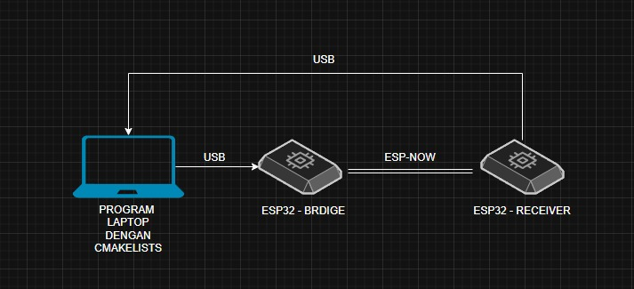

# TASK-4 Cross Platform File Transfer

> **DEADLINE SENIN, 20 OKT 2025 PUKUL 18.00**

Untuk task ini program yang akan kalian buat diharuskan untuk memecah-mecah file `.json` yang akan kalian buat di laptop kalian (detail file .json yang harus dibuat ada di ketentuan). Dari hasil pecahan tersebut kalian harus mengirimkan data hasil tersebut ke esp-bridge atau esp yang terhubung ke laptop kalian melalui **serial communication**. Saat esp-bridge kalian menerima data dari serial communication, esp-bridge tersebut kemudian meneruskan ke esp-receiver melalui **ESP-NOW**. Esp-receiver di lain sisi ketika menerima data terusan dari **ESP-NOW**, akan menyusun kembali tiap pecahan data yang dikirim ke **SPIFFS** esp-receiver. Saat pengiriman dan penyusunan data sudah selesai, maka esp receiver akan memberikan output melalui serial monitor sesuai dengan format yang akan dijelaskan di README ini.



Diagram di atas adalah gambaran alurnya. Dan bisa dilihat alurnya adalah **SATU ARAH**

### KETENTUAN 

file `.json` yang harus kalian buat harus memenuhi format di bawah ini. Setiap key pada contoh di bawah harus ada di file `.json` kalian, sedangkan value nya dibebaskan. value `deskripsi` harus memiliki kata **setidaknya 25 kata**.

```json
{
    "nama": "Emir Chaesa",
    "jurusan": "Teknik Material Metalurgi",
    "umur": 30,
    "deskripsi": "Saya adalah orang yang sangat disiplin dan rendah hati. Saya juga senang bermain bola di lapangan. Saya Juga General Manager dari tim VI-ROSE."
}
```

Setelah esp-receiver selesai menyusun data dari ESP-NOW, esp-receiver harus mengoutputkan hasil data yang sudah disusun ke serial monitor dengan format:
```
[KONTEN FILE YANG DITERIMA]
NAMA: Emir Chaesa
JURUSAN: Teknik Material Metalurgi
UMUR: 30
DESKRIPSI DIRI: Saya adalah orang yang sangat disiplin dan rendah hati. Saya juga senang bermain bola di lapangan. Saya Juga General Manager dari tim VI-ROSE.
```

#### Catatan
Nilai Plus Jika Program Pada Laptop:
- Mengimplementasikan OOP
- Menggunakan CMakeLists

Nilai Plus Jika Program ESP:
- Mengimplementasikan header
- Mengimplementasikan protokol pada tiap pengiriman data.