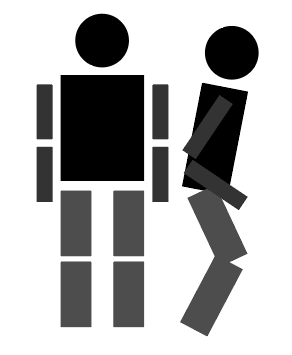

# TASK - FINAL

> **DEADLINE SENIN, 2 NOV 2025 PUKUL 18.00**

### Contents:

- [DESKRIPSI TUGAS](#deskripsi-tugas)
- [DETAIL PENUGASAN](#detail-penugasan)
- [PROGRAM-REMOTE](#program-remote)
- [TRANSMITTER](#transmitter)
- [RECEIVER](#receiver)
- [WEBOTS](#webots)
- [CARA-BERJALAN](#cara-berjalan)
- [POSE-CONTROLLER](#pose-controller)

## DESKRIPSI TUGAS

Diminta untuk membuat kontroler robot humanoid yang dapat menerima input dari keyboard untuk menggerakkan robot tersebut di dalam simulasi Webots. Robot harus mampu melakukan perpindahan posisi dengan cara bergerak maju, mundur, geser kanan, kiri dan belok kanan, kiri sesuai dengan perintah yang diberikan melalui keyboard.

## DETAIL PENUGASAN

kalian diminta untuk membuat 2 program yaitu program receiver dan program kontroller robot diwebots.

Skema alur program receiver dan controller robot. Perintah keyboard dikirimkan dari Remote ke Webots laptop lain melalui perantara ESP-NOW.

#### **TODO 1 ESP32**

    Buatlah Program Receiver untuk menerima perintah dari keyboard yang dikirimkan dalam bentuk ESP-NOW.

#### **TODO 2 WEBOTS**

    Buatlah Program Kontroller Robot di Webots untuk menggerakkan robot sesuai perintah yang diterima dari Program Receiver.

Pengujian dan presentasi akan dilakukan pada: pada 2 November 2025. Pengujian dilakukan dengan penguji yang mengirimkan perintah dari keyboard pada program Remote.

# **PROGRAM**

  
<b>PROGRAM_INPUT_KEYBOARD & TRANSMITTER</b>

    

    
    

    Deskripsi
    Program berfungsi untuk menerima input dari keyboard dan dikirimkan dalam bentuk Serial
        Perintah yang dapat dikirimkan adalah:
        - W, A, S, D, Q, E, C, V, R, F

    Hasil input dari keyboard akan dikirimkan melalui ESP-NOW dari Transmitter ke ESP_Receiver. dimana perintah yang dikirmkan berupa karakter ASCII atau nilainya.
    Panjang perintah hanya 1 yaitu berisi nilai key yang ditekan pada keyboard.

 

  
<b>RECEIVER</b>

    DESKRIPSI
    Program Receiver berfungsi untuk menerima perintah dari Transmitter dan meneruskannya ke Webots. Program ini akan berjalan di ESP32 yang terhubung dengan robot humanoid.

    KETENTUAN
    - Struktur folder atau program bersifat bebas.
    - Nilai identitas(MAC Address) dari Receiver disesuaikan dengan milik masing-masing.
    - MAC Address sudah dialokasikan pada file main.cpp, boleh dipindah-pindah sesuai kebutuhan tapi tidak boleh dirubah isinya.

 

 

  
<b>WEBOTS</b>

  

    
  

    DESKRIPSI
    Program Kontroller Robot di Webots berfungsi untuk menggerakkan robot sesuai perintah yang diterima dari Program Receiver. Program ini akan berjalan di dalam simulasi Webots pada laptop yang berbeda dengan laptop tempat Program Receiver berjalan.

    KETENTUAN
    - Struktur folder atau program bersifat bebas.
    - controller-fp.cpp hanya bersifat sebagai contoh atau placeholder, boleh dihapus atau dimodifikasi sesuai kebutuhan.

    <h3>Struktur Robot</h3>
    <a href="https://cyberbotics.com/doc/guide/robotis-op2?version=R2022a#robotisop2hinge2-variant" alt="Dokumentasi Robot">Webots Robotis OP2 Proto</a>
    

 

# EXTRA

  
<b>CARA BERJALAN</b>

  

    Pose berjalan dimasukin ke json, untuk setiap pose kalian bisa bikin sendiri atau nunggu aku, bakal tak buatin template dengan struktur json yang sama.

  

  <h3><b>Pose</b></h3>
  <ul>
    <li> 

        
 <B>Berdiri</B> 

        https://github.com/virose-its/MODUL-PEMBELAJARAN/blob/a3a8ad769d44f037fd173d8aa18305681baf0f95/Programming/PENUGASAN/TASK-FINAL/Webots/poses/pose-berdiri.json#L1-L19
        

        

    </li>
    <li> 

        
 <B>Jalan Maju</B> 

        https://github.com/virose-its/MODUL-PEMBELAJARAN/blob/a3a8ad769d44f037fd173d8aa18305681baf0f95/Programming/PENUGASAN/TASK-FINAL/Webots/poses/pose-jalan-maju.json#L1-L132
        

        

    </li>
    <li> 

        
 <B>Jalan Mundur</B> 

        https://github.com/virose-its/MODUL-PEMBELAJARAN/blob/a3a8ad769d44f037fd173d8aa18305681baf0f95/Programming/PENUGASAN/TASK-FINAL/Webots/poses/pose-jalan-mundur.json#L1-L133
        

        

        

    </li>
    <li> 

        
 <B>Geser Kanan</B> 

        https://github.com/virose-its/MODUL-PEMBELAJARAN/blob/a3a8ad769d44f037fd173d8aa18305681baf0f95/Programming/PENUGASAN/TASK-FINAL/Webots/poses/pose-geser-kanan.json#L1-L48
        

        

    </li>
    <li> 

        
 <B>Geser Kiri</B> 

        https://github.com/virose-its/MODUL-PEMBELAJARAN/blob/a3a8ad769d44f037fd173d8aa18305681baf0f95/Programming/PENUGASAN/TASK-FINAL/Webots/poses/pose-geser-kiri.json#L1-L48
        

        

    </li>
    <li> 

        
 <B>Belok Kanan</B> 

        https://github.com/virose-its/MODUL-PEMBELAJARAN/blob/a3a8ad769d44f037fd173d8aa18305681baf0f95/Programming/PENUGASAN/TASK-FINAL/Webots/poses/pose-belok-kanan.json#L1-L48
        

        

    </li>
    <li> 

        
 <B>Belok Kiri</B> 

        https://github.com/virose-its/MODUL-PEMBELAJARAN/blob/a3a8ad769d44f037fd173d8aa18305681baf0f95/Programming/PENUGASAN/TASK-FINAL/Webots/poses/pose-geser-kiri.json#L1-L48
        

        

    </li>
  </ul>

 

  
<b>POSE CONTROLLER</b>

  
  
    Pose controller cuma controller tambahan yang bisa kalian pake buat ngebuat pose di robot. Kalian bisa pake ini buat ngebantu bikin gerakan di robot.
   

