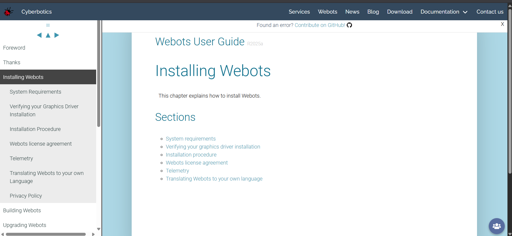
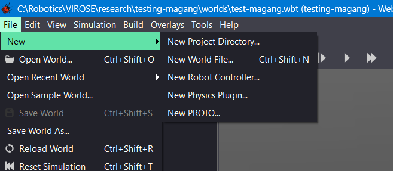
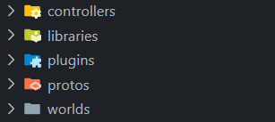

# SIMULASI DENGAN WEBOTS


Webots adalah sebuah simulator robot 3D open-source yang digunakan secara luas untuk keperluan pemodelan, pemrograman, dan simulasi robot. Software ini menyediakan lingkungan pengembangan yang lengkap untuk memodelkan robot, sensor, dan lingkungan sekitarnya.

Dengan physics engine yang kuat, Webots memungkinkan simulasi yang realistis terhadap perilaku robot di berbagai kondisi. Kita dapat memprogram logika robot menggunakan berbagai bahasa pemrograman populer seperti C++, Python, Java, atau MATLAB. Webots sangat berguna dalam bidang penelitian, pendidikan, dan pengembangan prototipe robot sebelum diimplementasikan pada robot sesungguhnya.

## SETUP WEBOTS

Untuk menggunakan webots, kalian harus meng-*install* software nya terlebih dahulu melalui link berikut ini,

`https://cyberbotics.com/doc/guide/installing-webots`

link di atas akan mengarahkan ke website official dari webots seperti berikut,



ikuti hingga sections installation procedure. Pastikan install sesuai dengan OS kalian.

## STRUKTUR PROJECT

Pada saat kalian ingin membuat project webots baru, kalian bisa mengikuti langkah-langkah berikut ini.

1. Pada window webots, kalian bisa mengklik `new project directory` seperti pada gambar di bawah ini. Setelah itu, kalian bisa memilih folder project yang baru kalian buat.
   
    

1. Setelah membuat project baru, akan ada file-file dan folder-folder yang otomatis dibuat oleh webots seperti gambar di bawah ini.

    

## TEMPLATE CMAKE

Di bawah ini adalah template CMake yang bisa kalian gunakan untuk membuat controller dari robot kalian di webots nanti.

```cmake
cmake_minimum_required(VERSION 3.15)

get_filename_component(PROJECT ${CMAKE_CURRENT_SOURCE_DIR} NAME)
project(${PROJECT})

if(NOT DEFINED ENV{WEBOTS_HOME})
  message(FATAL_ERROR "WEBOTS_HOME environment variable not set. Please set it to your Webots installation directory.")
endif()

set(WEBOTS_HOME "$ENV{WEBOTS_HOME}")
string(REPLACE "\\" "/" WEBOTS_HOME "${WEBOTS_HOME}")

set(SOURCES
    epuck_avoid_collision.cpp
)

set(LIBRARIES
    ${WEBOTS_HOME}/lib/controller/libController.a
    ${WEBOTS_HOME}/lib/controller/libCppController.a
)

include_directories(
    ${WEBOTS_HOME}/include/controller/cpp
    ${WEBOTS_HOME}/include/controller/c
)

add_executable(${PROJECT} ${SOURCES})
target_compile_definitions(${PROJECT} PRIVATE WEBOTS_USED_BY_CONTROLLER)
target_link_libraries(${PROJECT} PRIVATE ${LIBRARIES})

add_custom_command(TARGET ${PROJECT} POST_BUILD COMMAND ${CMAKE_COMMAND} -E
  copy $<TARGET_FILE:${PROJECT}> ${CMAKE_CURRENT_SOURCE_DIR}
)
```

## HANDS ON


